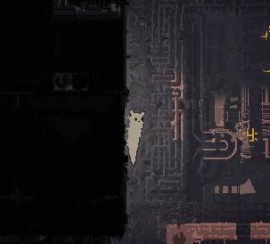

# RW-Slugs
An unplanned set of BepInEx plugins for Rain World, each adding a new character based on [Slime_Cubed's SlugBase](https://github.com/SlimeCubed/SlugBase).

I currently plan to release each slugcat as a seperate mod so users can pick and choose... That's assuming I manage to think of ideas for more.
  

### Installation
Grab the DLL from [here](https://github.com/casheww/RW-Slugs/releases/latest) and install as you would any Rain World BepInEx plugin.
Requires [SlugBase](https://github.com/SlimeCubed/SlugBase/releases/latest)!

---

## The Mountaineer
*While struggling in the dazzling light of day, this creature is a hardy climber and caver.*

#### Stats
- Food to hibernate: 4
- Max food: 9
- Pole climb speed: x1.25
- Corridor speed: x1.4

#### Abilities
- Increased run speed when in the dark (x1.6)
- Can climb walls (hold grab button and move up/down)
